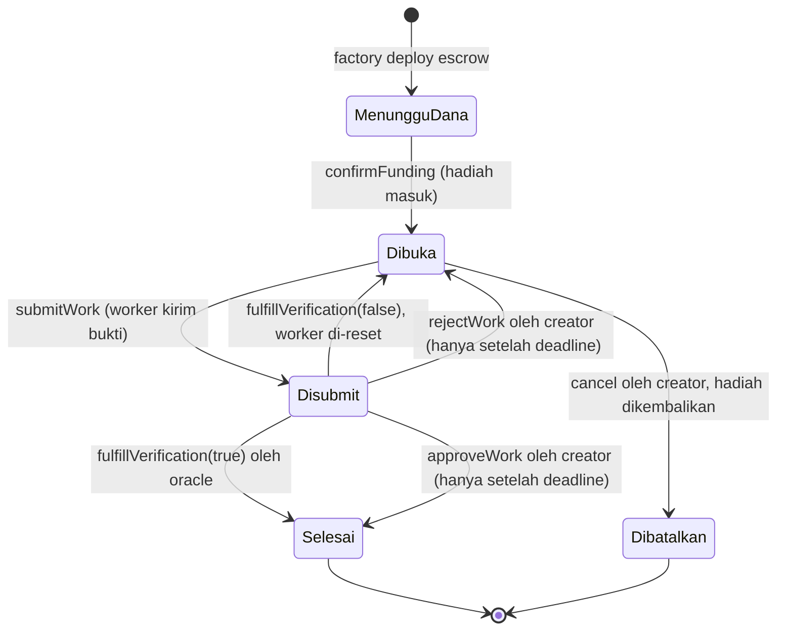

<h1 align="center">Papan Sayembara (Bounty Board)</h1>

<p align="center">
  Escrow bounty on-chain dengan hadiah ERC20, putusan oracle, dan dua indexer pembaca chain.
</p>

<p align="center">
  
  
  
  
  
  
</p>

> [!NOTE]
> Repositori latihan Indonesia Web3 Hackathon 2026 (bootcamp DevWeb3 Jogja), Sesi 3
> sampai Sesi 5. Semua kontrak jalan di **BNB Smart Chain Testnet**, tidak ada nilai
> uang sungguhan. Token hadiah adalah token uji yang dicetak sendiri.

## Daftar Isi

- [Yang dibangun](#yang-dibangun)
- [Alamat live](#alamat-live)
- [Siklus hidup bounty](#siklus-hidup-bounty)
- [Dua pendekatan indexing](#dua-pendekatan-indexing)
- [Ketahanan data](#ketahanan-data)
- [Instalasi](#instalasi)
- [Pakai](#pakai)
- [Test](#test)
- [Struktur direktori](#struktur-direktori)
- [Lisensi](#lisensi)

## Yang dibangun

| Kontrak | Peran |
|---|---|
| `RewardToken.sol` | ERC20 hadiah. Ownable, batas `MAX_SUPPLY` 1 juta, daftar minter terpisah dari owner, custom error, bisa burn. |
| `BountyEscrow.sol` | Escrow satu bounty. Hadiah dikunci sampai karya diputus lolos atau ditolak. State machine 5 keadaan, pola checks-effects-interactions, penjaga reentrancy. |
| `BountyFactory.sol` | Mencetak satu escrow per bounty dalam satu transaksi atomic (deploy plus kunci hadiah), menyimpan registry alamatnya, dan memegang alamat oracle. |

Rinciannya, termasuk alasan setiap keputusan desain, ada di
[`docs/ARSITEKTUR.md`](docs/ARSITEKTUR.md).

## Alamat live

Ketiganya sudah terverifikasi sumbernya di BscScan Testnet.

| Kontrak | Alamat |
|---|---|
| RewardToken | [`0x07238d9a680488e267477139643088af34abd890`](https://testnet.bscscan.com/address/0x07238d9a680488e267477139643088af34abd890) |
| BountyFactory | [`0xd5e8f3480448d165cbbcbde1036303855b883d09`](https://testnet.bscscan.com/address/0xd5e8f3480448d165cbbcbde1036303855b883d09) |

Escrow dicetak factory, jadi alamatnya bertambah seiring bounty dibuat. Ambil
daftar terkini lewat `cast call <factory> "bounties(uint256)(address)" <index>`
atau dari endpoint `/board` di `backend/`.

## Siklus hidup bounty



> [!IMPORTANT]
> Selama tenggat submission belum lewat, hanya oracle yang boleh memutus. Creator
> baru boleh turun tangan setelah tenggat, supaya ia tidak bisa mendahului putusan
> oracle untuk karya yang sudah masuk.

## Dua pendekatan indexing

Kontrak di atas tidak berguna kalau isinya tidak bisa dibaca. Dua indexer di sini
membaca chain yang sama dengan cara berbeda.

| | `backend/` | `ponder/` |
|---|---|---|
| Tumpukan | Bun, Hono, viem, `bun:sqlite` | Ponder 0.17, PGlite |
| Antarmuka | REST, 5 endpoint | GraphQL |
| Cara pindai riwayat | `getLogs` per 999 block plus checkpoint | otomatis oleh framework |
| Menyusul event baru | `watchEvent` real-time | real-time setelah backfill selesai |
| Melacak escrow anak | daftar escrow disimpan di tabel, escrow baru langsung dipantau | `factory()` bawaan Ponder |
| Ketahanan terhadap reorg | rekonsiliasi hash block, lihat `src/indexer/reorg.ts` | ditangani framework |
| Kecepatan backfill terukur | sekitar 30.000 block per menit | sekitar 828 block per menit |

> [!TIP]
> Untuk riwayat panjang, indexer custom jauh lebih cepat karena hanya mengambil
> log, tanpa menarik header block. Ponder lebih ringkas ditulis dan langsung
> memberi GraphQL. Pilih sesuai kebutuhan, bukan sesuai kebaruan.

> [!NOTE]
> Kode di sini mengikuti materi workshop kata per kata, kecuali penyimpangan yang
> disengaja berikut, semuanya diberi komentar di tempatnya:
>
> - dua alamat kontrak plus block deploy di `backend/src/config.ts` dan
>   `ponder/ponder.config.ts`, karena ini deployment sendiri, bukan deployment mentor
> - penjaga pendaftaran watcher di `backend/src/index.ts`. Tanpa itu `bun run --hot`
>   mendaftarkan watcher baru setiap reload tanpa menutup yang lama, sehingga satu
>   event memicu handler sebanyak jumlah reload
> - kolom `block_hash`, modul `src/indexer/reorg.ts`, dan pemanggilannya di entry
>   point, untuk menangani reorg (penjelasan di bawah)
> - `DB_PATH` bisa ditimpa lewat env, supaya test tidak menyentuh basis data sungguhan
> - `seed.ts` dan `seed.sql`, untuk ketahanan data (penjelasan di bawah)

Keduanya melacak empat event: `BountyCreated`, `WorkSubmitted`, `RewardReleased`,
dan `WorkRejected`.

> [!NOTE]
> `BountyFunded`, `VerificationFulfilled`, dan `BountyCancelled` sengaja belum
> dilacak, mengikuti cakupan materi workshop. Akibatnya bounty yang dibatalkan
> tidak berubah di basis data indexer. Endpoint `/bounty/:escrow` tetap benar
> karena membaca langsung dari chain, bukan dari basis data.

Endpoint REST di `backend/`:

| Endpoint | Isi |
|---|---|
| `GET /board` | semua bounty plus submission hasil indexing, ditambah total live dari factory |
| `GET /bounty/:escrow` | detail satu escrow, 6 fungsi view digabung jadi satu request lewat multicall |
| `GET /wallet/:address` | bounty yang dibuat dan submission milik satu wallet |
| `GET /balance/:address` | saldo token hadiah |
| `GET /health` | cek server hidup |

## Ketahanan data

Dua masalah nyata yang tidak kelihatan sampai indexer dipakai lebih dari sehari.

### Reorg

Insert indexer idempotent, jadi scan ulang aman. Tapi idempotent tidak berarti
self-healing. Kalau sebuah block ter-reorg keluar dari chain, barisnya tetap
tinggal di basis data selamanya dan API menyajikan event yang sudah tidak ada.
Checkpoint hanya bergerak maju, jadi tidak ada yang membersihkannya.

Penanganannya: `block_hash` dicatat saat indexing, lalu `reconcile()` membandingkan
hash tercatat dengan hash kanonik pada ketinggian yang sama untuk 200 block
terakhir. Kalau beda, barisnya dihapus dan checkpoint diputar ke sebelum block itu
supaya backfill mengisi ulang versi yang kanonik. Dijalankan saat startup dan tiap
5 menit setelahnya.

### Riwayat yang hilang dari RPC

RPC publik BSC Testnet memangkas riwayat block lama. Diuji pada 4 Agustus 2026
untuk block deploy 121410684:

| RPC | Hasil |
|---|---|
| thirdweb | menyajikan |
| publicnode | "History has been pruned for this block" |
| bnbchain resmi | "limit exceeded" |
| drpc | error internal |

**Satu dari empat.** Begitu yang terakhir menyusul memangkas, riwayat awal tidak
bisa diindeks ulang oleh siapa pun, dan klon baru akan selamanya punya basis data
kosong untuk periode itu.

Karena itu `backend/seed.sql` di-commit meski isinya data turunan. Ini pengecualian
yang disengaja: sumber kebenarannya sedang menghilang, jadi snapshot menjadi satu-
satunya salinan. Seed menyertakan `sync_checkpoint`, sehingga klon baru langsung
melanjutkan ke depan dan tidak mencoba memindai riwayat yang sudah tidak ada.

```bash
cd backend
bun run seed:import   # pulihkan riwayat ke basis data kosong, aman diulang
bun run seed:export   # perbarui snapshot setelah ada bounty baru
```

Jalur pemulihan ini diuji di CI, bukan cuma diasumsikan jalan.

## Instalasi

```bash
git clone --recurse-submodules <url-repo> && cd reward-token
forge build
cp .env.example .env   # isi PRIVATE_KEY wallet dev, jangan wallet asli
```

Butuh [Foundry](https://book.getfoundry.sh/getting-started/installation) untuk
kontrak dan [Bun](https://bun.sh) untuk indexer.

> [!CAUTION]
> Wallet yang sama sekaligus owner token, owner factory, oracle, creator, dan
> worker. Untuk demo testnet itu praktis, tapi kalau kuncinya bocor penyerang
> menguasai seluruh sistem, bukan sebagian. Jangan pernah pola ini menyentuh
> mainnet, dan pakai wallet khusus yang terpisah dari wallet asli.

## Pakai

<details><summary>Deploy dua tahap ke BNB Testnet</summary>

Token dulu, lalu factory memakai alamat token tahap pertama.

```bash
forge script script/DeployRewardToken.s.sol --rpc-url bsc_testnet --broadcast --verify --legacy -vvvv
# salin alamat token ke REWARD_TOKEN di .env, isi juga ORACLE_ADDRESS
forge script script/DeployBountyFactory.s.sol --rpc-url bsc_testnet --broadcast --verify --legacy -vvvv
```

> [!WARNING]
> Jangan mengunci `gas_price` di `foundry.toml` kalau saldo faucet tipis. Harga
> jaringan BSC Testnet sekitar 0,05 gwei, biarkan forge memperkirakan sendiri.

</details>

<details><summary>Bikin bounty lalu putuskan lewat oracle</summary>

```bash
# 1. izinkan factory memindahkan hadiah
cast send $REWARD_TOKEN "approve(address,uint256)" $FACTORY 10000000000000000000 \
  --private-key $PRIVATE_KEY --rpc-url $RPC --legacy

# 2. satu transaksi: deploy escrow plus kunci hadiah
cast send $FACTORY "createBounty(uint256,string,uint256)" \
  10000000000000000000 "https://contoh/RULES.md" $(( $(date +%s) + 3600 )) \
  --private-key $PRIVATE_KEY --rpc-url $RPC --legacy

# 3. worker kirim bukti
cast send $ESCROW "submitWork(string)" "https://contoh/BUKTI.md" \
  --private-key $PRIVATE_KEY --rpc-url $RPC --legacy

# 4. oracle memutus: true membayar, false menolak dan membuka lagi
cast send $ESCROW "fulfillVerification(bool)" true \
  --private-key $PRIVATE_KEY --rpc-url $RPC --legacy
```

> [!TIP]
> `approveWork()` milik creator akan revert selama tenggat belum lewat. Untuk
> memicu pembayaran secepatnya, pakai jalur oracle di atas.

</details>

<details><summary>Jalankan indexer</summary>

```bash
cd backend && bun install && bun run seed:import && bun dev  # REST di http://localhost:3000
cd ponder  && bun install && bun run dev                     # GraphQL di http://localhost:42069
```

Isi `ponder/.env.local` dengan `PONDER_RPC_URL_97`.

> [!CAUTION]
> Sebagian besar RPC publik BSC Testnet memangkas riwayat block yang lebih tua
> dari sekitar dua pekan, dan backfill akan gagal di block deploy. Yang terbukti
> masih menyajikannya adalah `https://97.rpc.thirdweb.com`. Indexer custom aman
> karena memakai daftar fallback lima RPC dengan peringkat kesehatan, dan karena
> `seed:import` sudah mengisi riwayat plus checkpoint sehingga periode yang sudah
> dipangkas tidak perlu dipindai lagi.

Perintah pertama kali menjalankan backfill sebelum membuka port HTTP, jadi
tunggu sampai baris ringkasan backfill muncul.

</details>

## Test

```bash
forge test                                            # 50 test kontrak
forge coverage --no-match-coverage "script/"          # 100 persen
cd backend && bun run typecheck && bun test           # 4 test indexer (logika reorg)
cd ponder  && bun run codegen && bunx tsc --noEmit    # typecheck ponder
```

| Berkas | Baris | Pernyataan | Cabang | Fungsi |
|---|---|---|---|---|
| `BountyEscrow.sol` | 67/67 | 65/65 | 18/18 | 12/12 |
| `BountyFactory.sol` | 19/19 | 19/19 | 3/3 | 4/4 |
| `RewardToken.sol` | 17/17 | 18/18 | 3/3 | 6/6 |

CI punya dua job: satu untuk kontrak (`forge fmt`, `build`, `test`) dan satu untuk
indexer (typecheck, test, pemulihan seed, codegen plus typecheck ponder). Job kedua
ada karena job kontrak tidak menyentuh `backend/` maupun `ponder/` sama sekali,
sehingga keduanya bisa rusak total sementara CI tetap hijau.

## Struktur direktori

```
src/                3 kontrak
test/               3 suite, 50 test
script/             skrip deploy dan bikin bounty
docs/               ARSITEKTUR.md, alasan di balik desain
backend/            indexer custom, REST
  src/indexer/      backfill, watch, handlers, reorg
  seed.sql          snapshot riwayat, satu-satunya salinan setelah RPC memangkas
  reorg.test.ts     4 test logika reorg, tanpa jaringan
ponder/             indexer Ponder, GraphQL
broadcast/          catatan transaksi deploy chain 97
```

## Lisensi

Hak cipta 2026 PT Surya Inovasi Prioritas (SURIOTA), dirilis di bawah lisensi MIT.
Lihat [LICENSE](LICENSE).
