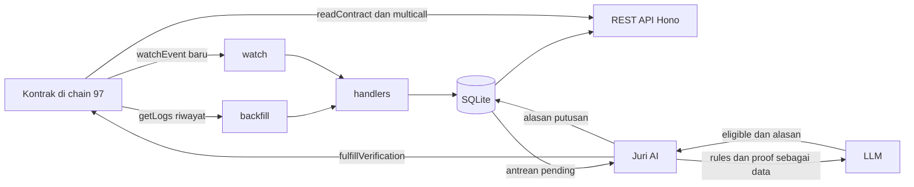

# Backend Papan Sayembara

Indexer plus REST API untuk kontrak bounty di BNB Smart Chain Testnet (chain 97),
ditambah juri AI yang menuliskan putusannya sendiri ke chain. Bun, Hono, viem, dan
`bun:sqlite`, tanpa layanan luar selain RPC dan satu endpoint LLM.

Latar belakang desain, penjelasan reorg, dan tabel batas kepercayaan ada di
[README repo](../README.md). Berkas ini cukup untuk menjalankan dan membaca kodenya.

## Cara menjalankan

```bash
bun install
cp .env.example .env    # isi RELAYER_PK, ORACLE_PK, dan LLM_API_KEY sesuai kebutuhan
bun run seed:import     # pulihkan riwayat awal, RPC publik sudah memangkasnya
bun dev                 # terminal 1: indexer plus REST di http://localhost:3000
bun oracle              # terminal 2: juri AI
```

Panggilan pertama menjalankan backfill sebelum port HTTP dibuka, jadi tunggu sampai
ringkasan backfill muncul. Semua baris `.env` opsional: yang dikosongkan hanya
mematikan fitur terkait, indexer dan endpoint baca tetap jalan.

```bash
bun run typecheck        # tsc --noEmit
bun run test             # 31 test, tanpa jaringan
bun run periksa-sesi6.ts # verifikasi ke chain, bukan ke log backend
```

> [!IMPORTANT]
> Pakai `bun run test`, bukan `bun test` mentah. Tiap berkas uji wajib jalan di
> prosesnya sendiri karena `src/lib/db.ts` membuka basis data sekali di tingkat modul.

## Daftar endpoint

| Method | Route | Deskripsi |
|---|---|---|
| GET | `/board` | Semua bounty plus submission hasil indexing, ditambah total live dari factory |
| GET | `/bounty/:escrow` | Detail satu escrow, live dari chain, 6 fungsi view dalam satu request multicall |
| GET | `/wallet/:address` | Bounty yang dibuat dan submission milik satu wallet |
| GET | `/balance/:address` | Saldo token hadiah sebuah wallet |
| GET | `/pending` | Submission berstatus `submitted`, antrean yang dibaca juri AI |
| GET | `/leaderboard` | Peringkat worker menurut jumlah kemenangan dan total hadiah |
| GET | `/verdicts/:escrow` | Riwayat putusan AI untuk satu bounty, beserta alasannya |
| POST | `/verdicts` | Simpan hasil plus alasan penilaian. Butuh `escrow`, `worker`, `eligible`, `alasan` |
| POST | `/relay/bounty` | Bikin bounty baru. Butuh `reward` dan `rules_uri`, opsional `deadline_jam` |
| POST | `/relay/bounty/:escrow/submit` | Kirim bukti kerjaan. Butuh `proof_uri` |
| GET | `/health` | Cek server hidup plus alamat relayer |

Dua route `/relay/*` menandatangani transaksi dan membayar gas sendiri, jadi
keduanya balas `503` kalau `RELAYER_PK` kosong. Alamat yang tidak valid balas `400`,
route tak dikenal balas `404`.

## Struktur file

| File | Fungsi |
|---|---|
| `src/config.ts` | Daftar RPC, alamat kontrak, block deploy, kunci privat, dan konfigurasi LLM |
| `src/contracts.ts` | ABI, definisi event, dan label enum status |
| `src/lib/chain.ts` | Public client viem plus transport fallback berperingkat |
| `src/lib/wallet.ts` | Wallet client relayer dan oracle, `null` kalau kuncinya kosong |
| `src/lib/db.ts` | Skema SQLite, prepared statement, dan semua query |
| `src/indexer/backfill.ts` | Pindai riwayat per `CHUNK` block, checkpoint maju setiap petak |
| `src/indexer/watch.ts` | `watchEvent` real-time, escrow baru langsung ikut dipantau |
| `src/indexer/handlers.ts` | Empat handler event menulis ke basis data, idempotent |
| `src/indexer/reorg.ts` | Rekonsiliasi hash block, buang baris yang ter-reorg keluar |
| `src/services/bounty.ts` | Baca state chain, gabungkan dengan hasil indexing, dan pastikan escrow benar hasil factory kita |
| `src/services/relayer.ts` | Transaksi tulis: approve, `createBounty`, `submitWork` |
| `src/services/judge.ts` | Panggil LLM, penjaga SSRF, urai putusan jadi `{eligible, alasan}` |
| `src/services/oracle.ts` | Kirim `fulfillVerification` sebagai oracle terdaftar |
| `src/routes/api.ts` | Definisi endpoint REST plus validasi masukan |
| `src/index.ts` | Entry point pertama: reorg, backfill, watch, lalu sajikan API |
| `src/oracle.ts` | Entry point kedua: loop juri AI |
| `seed.ts`, `seed.sql` | Ekspor dan impor snapshot riwayat plus alasan putusan AI, yang tidak ada di chain |
| `reorg.test.ts` | 4 test logika reorg, hash kanonik diinjeksi |
| `sesi6.test.ts` | 27 test jalur Sesi 6, LLM diganti server tiruan |
| `periksa-sesi6.ts` | Verifikasi independen ke chain dengan viem |

## Konfigurasi environment

| Variabel | Wajib | Isi |
|---|---|---|
| `RPC_URL` | tidak | RPC yang dicoba pertama. Block deploy sudah dipangkas di sebagian besar RPC publik, `https://97.rpc.thirdweb.com` masih menyajikannya |
| `PORT` | tidak | Port API, default 3000 |
| `CHUNK` | tidak | Lebar jendela `getLogs`, default 999 supaya muat di semua RPC gratis |
| `DB_PATH` | tidak | Lokasi berkas SQLite, dipakai test supaya tidak menyentuh basis data sungguhan |
| `RELAYER_PK` | untuk `/relay/*` | Kunci privat pembayar gas dan hadiah |
| `ORACLE_PK` | untuk `bun oracle` | Kunci privat juri. Alamatnya wajib terdaftar sebagai oracle di factory |
| `LLM_BASE_URL` | tidak | Endpoint OpenAI-compatible, misalnya OpenAI, OpenRouter, Groq, atau GLM. Default `https://api.openai.com/v1` |
| `LLM_MODEL` | tidak | Nama model di provider tersebut. Default `gpt-4o-mini` |
| `LLM_API_KEY` | untuk `bun oracle` | Kunci API provider |
| `POLL_INTERVAL_SECONDS` | tidak | Jeda polling juri, default 15 |

## Catatan untuk produksi

- `POST /verdicts` dan `/relay/*` belum punya autentikasi. Aman selama hanya
  dijalankan di mesin sendiri, berbahaya begitu portnya terjangkau dari luar. CORS
  sudah dibatasi ke origin localhost supaya halaman web sembarangan tidak bisa
  memanggilnya dari browser di mesin ini.
- Satu kunci privat memegang peran owner token, owner factory, dan oracle sekaligus.
  Praktis untuk demo testnet, tidak boleh dipakai di mainnet. Efek sampingnya: dua
  transaksi tulis yang bersamaan berlomba nonce di wallet yang sama.
- Penjaga SSRF memeriksa hostname lalu IP hasil resolusi, dan menolak redirect. Yang
  belum tertutup adalah celah waktu antara pemeriksaan dan pengambilan, karena `fetch`
  me-resolve ulang sendiri. Sambungkan ke IP yang sudah diperiksa sebelum backend ini
  dijalankan di server yang punya jaringan internal.
- Putusan `eligible` berasal dari LLM, dan LLM bisa dibujuk. Untuk sistem sungguhan,
  putusannya harus deterministik dan LLM cuma menuliskan alasannya.
- `created_at` di basis data adalah waktu saat indexing, bukan timestamp block.
  Jangan menampilkannya sebagai waktu bounty dibuat.

## Alur data


