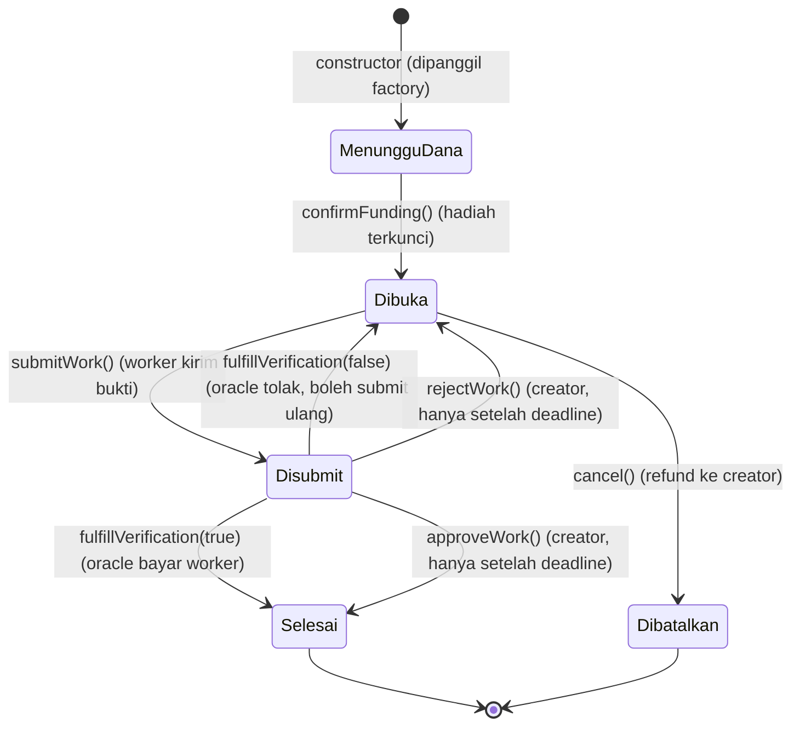
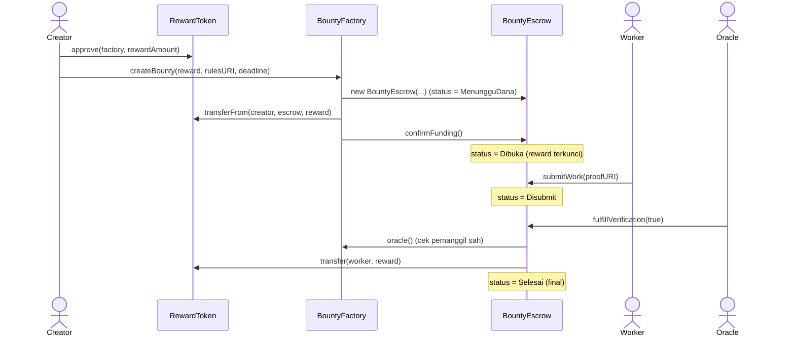
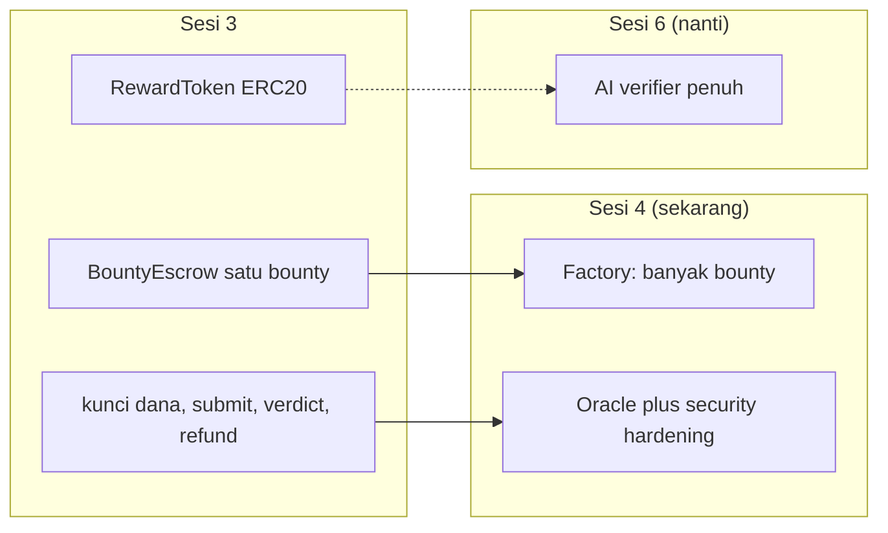
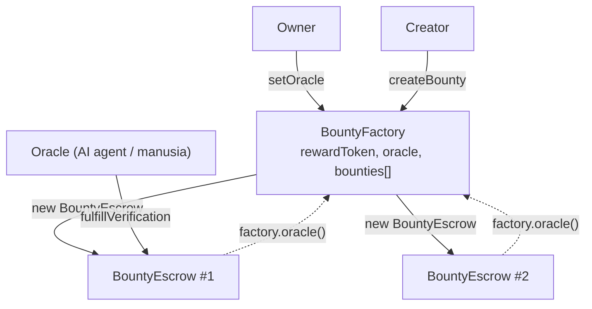
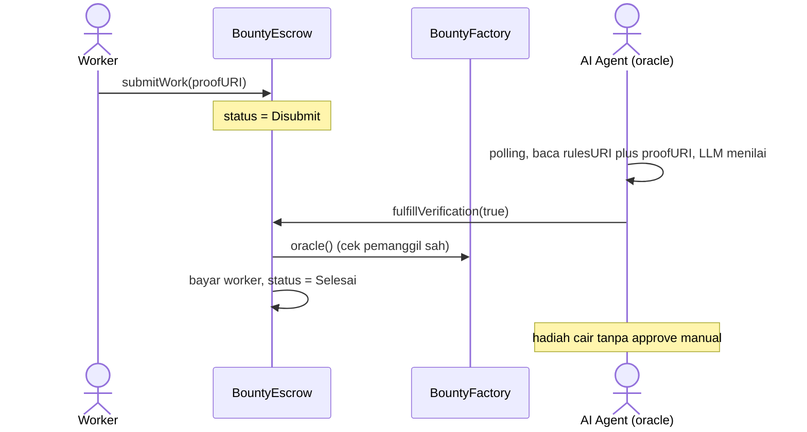

# Arsitektur BountyEscrow (Papan Sayembara) - Sesi 3 plus Sesi 4

Catatan konsep dan arsitektur untuk kontrak escrow bounty. Bagian 1-6 adalah fondasi
Sesi 3 (escrow inti). Bagian 7 adalah bentuk final Sesi 4 (Factory pattern plus oracle).

> [!NOTE]
> Sesi 3 = **mekanisme escrow inti** satu bounty. Sesi 4 menambah **BountyFactory**
> (satu pabrik nyetak banyak escrow) dan mengganti approve manual creator dengan
> **verdict oracle** (`fulfillVerification`). Wallet oracle bisa diisi manusia (demo)
> atau AI agent (BNB Agent Studio, no-code, di luar Foundry).

> [!IMPORTANT]
> Kode di repo ini **disamakan penuh dengan kode final materi Sesi 4** (26 Juli 2026).
> API Sesi 3 yang lama (`fund()`, `submit()`, `approve()`, `reject()`, peran "funder")
> sudah tidak ada. Bagian 1-6 mempertahankan penjelasan konsep Sesi 3, tetapi nama
> fungsi yang dipakai adalah nama final. Riwayat versi lama ada di commit `11dec4c`.

## 1. Konsep escrow

Escrow adalah pihak ketiga tepercaya yang memegang dana sampai syarat terpenuhi. Di sini
"pihak ketiga" itu bukan orang, melainkan smart contract, jadi tidak ada yang bisa
kabur membawa dana. Tiga pilar:

| Pilar | Arti | Fungsi terkait |
|---|---|---|
| Kunci dana | Reward dipindah dari creator ke kontrak, terkunci | `confirmFunding()` |
| Pelepasan bersyarat | Dana keluar hanya bila karya dinyatakan layak | `fulfillVerification(true)` |
| Pengembalian (refund) | Dana balik ke creator bila bounty dibatalkan | `cancel()` |

## 2. Peran

| Peran | Deskripsi |
|---|---|
| **Creator** | Pembuat bounty. Mendanai (via factory), membatalkan, dan jadi cadangan penilai setelah deadline |
| **Worker** | Pengerja. Mengirim karya sebelum deadline |
| **Oracle** | Wallet penilai (manusia atau AI agent). Satu-satunya yang boleh menulis verdict |
| **RewardToken** | Token ERC20 (RWD) yang dipakai sebagai hadiah |
| **BountyEscrow** | Kontrak yang menahan reward dan menegakkan aturan |
| **BountyFactory** | Pencetak escrow, registry, dan sumber tunggal alamat oracle |

## 3. Siklus hidup bounty (state machine)

Satu bounty berjalan lewat lima status. Panah = fungsi yang memindah status.



Catatan aturan:

- `MenungguDana` hanya hidup di dalam satu transaksi. `createBounty` di factory langsung
  mengirim token lalu memanggil `confirmFunding()`, jadi escrow yang lahir sudah terdanai.
- `submitWork()` ditolak bila `block.timestamp > submissionDeadline`.
- Penolakan mengembalikan status ke `Dibuka` dan mengosongkan data worker, sehingga worker
  lain (atau yang sama) dapat mencoba lagi. Reward tetap terkunci.
- `cancel()` **hanya boleh di status `Dibuka`**. Begitu ada submission, creator tidak bisa
  lagi menarik hadiah. Ini yang melindungi worker dari dirampok setelah kerja dikirim.
- `Selesai` dan `Dibatalkan` bersifat final (tidak ada transisi keluar).

## 4. Alur happy path (verdict oracle)



## 5. Keamanan: checks-effects-interactions (CEI)

Setiap fungsi yang menggerakkan token mengikuti urutan **checks -> effects -> interactions**:

1. **Checks** - validasi status, peran, deadline, input (revert dengan custom error bila gagal).
2. **Effects** - ubah state kontrak (`status`, `worker`) **sebelum** transfer.
3. **Interactions** - baru panggil token (`safeTransfer` / `safeTransferFrom`) di akhir.

Contoh di `_releaseReward()`: `status` diubah ke `Selesai` dulu, baru `transfer` ke worker.
Urutan ini mematikan reentrancy tanpa perlu `nonReentrant`, karena saat token dipanggil
status sudah final sehingga panggilan balik tidak menemukan state yang bisa diperas.
Transfer token juga memakai `SafeERC20` agar token yang tidak mengembalikan `bool` tetap
tertangani dengan benar.

## 6. Batas scope



> [!TIP]
> Untuk project hackathon (WattSettle), `fulfillVerification` inilah titik yang nanti
> pemicunya diganti dari oracle manual menjadi **AI Verifier** (Sesi 6).
> Peta peran: creator = pembeli energi, worker = produsen/perangkat, reward = token settlement.

## 7. Sesi 4: Factory pattern plus oracle

### 7.1 Kenapa Factory

Sesi 3 men-deploy satu escrow manual. Untuk banyak bounty, tiap kali deploy manual itu
mahal dan tak terlacak. **BountyFactory** menyelesaikan tiga hal: (1) `createBounty(...)`
nyetak satu `BountyEscrow` baru lewat `new BountyEscrow(...)` (kontrak nyetak kontrak),
(2) menyimpan registry semua escrow (`bounties[]`, `totalBounties()`), dan (3) mendanai
escrow dalam transaksi yang sama sehingga tidak ada bounty menganggur tanpa hadiah.

> [!IMPORTANT]
> Jebakan constructor: kalau escrow pakai `creator = msg.sender`, saat dideploy Factory
> maka `msg.sender` = alamat Factory, bukan pembuat asli. Solusi: Factory mengoper
> `msg.sender` (pemanggil `createBounty`) sebagai argumen `_creator` ke constructor escrow.
> Sebaliknya `factory` justru **sengaja** diambil dari `msg.sender` di constructor, karena
> di titik itu pemanggilnya memang factory.

### 7.2 Kenapa oracle dan pola cross-contract call

Approve manual creator itu subjektif dan tidak bisa diotomasi. Sesi 4 memindah keputusan
ke **oracle**: sebuah wallet (manusia atau AI agent) yang menilai submission lalu menulis
verdict on-chain lewat `fulfillVerification(bool)`. Alamat oracle disimpan **di Factory**
(`setOracle`, owner-only), bukan di tiap escrow. Escrow membaca oracle aktif lewat
**cross-contract call** `factory.oracle()` setiap verifikasi. Efek: ganti oracle cukup
sekali di Factory, seluruh escrow ikut berubah, tanpa sentuh escrow satu per satu.



### 7.3 Fallback creator: kalau oracle mati

Kalau seluruh keputusan bergantung pada satu wallet oracle, oracle yang mati berarti dana
terkunci selamanya. Karena itu `approveWork()` dan `rejectWork()` tetap ada, tetapi
**dikunci sampai deadline lewat**:

```solidity
if (block.timestamp <= submissionDeadline) revert OracleMasihBertugas(submissionDeadline);
```

Selama deadline belum lewat, oracle yang berkuasa dan creator tidak bisa menyerobot.
Setelah deadline lewat, creator boleh memutuskan sendiri. Ini menutup risiko liveness tanpa
membuka celah creator merampas verdict.

### 7.4 Alur auto-approve (Tab 2)



### 7.5 Keamanan tambahan

- **`ReentrancyGuard`** (OpenZeppelin) di `fulfillVerification`, `approveWork`, dan `cancel`,
  yaitu jalur yang memanggil token eksternal. CEI dari Sesi 3 tetap dipertahankan, guard
  sebagai lapis kedua.
- **`Ownable`** untuk `setOracle` (hanya owner Factory boleh ganti oracle).
- Modifier `hanyaOracle` menolak siapa pun kecuali `factory.oracle()` aktif. Factory menolak
  oracle `address(0)` baik di constructor maupun `setOracle`, jadi tidak ada kondisi
  "oracle kosong".
- Modifier `hanyaFactory` memastikan `confirmFunding()` tidak bisa dipanggil pihak luar untuk
  memaksa status `Dibuka` tanpa dana. Selain itu `confirmFunding` mengecek saldo token
  kontrak sendiri (`DanaKurang`), jadi status hanya naik kalau hadiah benar-benar sudah masuk.
- `cancel()` dibatasi ke status `Dibuka` sehingga creator tidak bisa menarik hadiah setelah
  worker mengirim bukti.

> [!WARNING]
> Sesuai kode materi, `submitWork()` tidak melarang creator submit ke bounty-nya sendiri.
> Untuk demo workshop ini tidak masalah. Kalau pola ini dipakai di WattSettle, tambahkan
> penolakan `msg.sender == creator` supaya creator tidak bisa memutar dana sendiri.

## 8. Status implementasi

Sesi 3:
- [x] `RewardToken.sol` (ERC20, cap, minter, burn)
- [x] `BountyEscrow.sol` state machine lima status, CEI, SafeERC20

Sesi 4:
- [x] `BountyEscrow.sol` versi final materi (`confirmFunding`, `submitWork`,
      `fulfillVerification`, fallback `approveWork`/`rejectWork`, `ReentrancyGuard`)
- [x] `BountyFactory.sol` (Factory pattern, funding atomik, registry, `setOracle`, `Ownable`)
- [x] `DeployBountyFactory.s.sol` plus `CreateBounty.s.sol` sesuai materi
      (`DeployBountyEscrow.s.sol` dihapus, escrow tidak lagi dideploy langsung)
- [x] **50 test hijau, coverage 100%** (lines/statements/branches/funcs) untuk 3 kontrak
- [x] Dry run end-to-end di Anvil: createBounty, submitWork, revert `OracleMasihBertugas`,
      revert `BukanOracle`, `fulfillVerification(true)`, hadiah cair ke worker
- [x] Deploy plus verifikasi di BNB Testnet (chain 97), ketiga kontrak verified di BscScan
- [x] Demo oracle manusia on-chain: submitWork lalu fulfillVerification(true), hadiah cair
- [ ] Tab 2: setOracle ke wallet AI agent (BNB Agent Studio, menunggu folder `agent-oracle/`
      dipublikasikan panitia)

### 8.1 Alamat live di BNB Testnet (chain 97)

| Kontrak | Alamat | Catatan |
|---|---|---|
| RewardToken | `0x07238d9a680488E267477139643088aF34abd890` | ERC20 RWD, suplai awal 1000 |
| BountyFactory | `0xd5E8F3480448D165CbbCBde1036303855B883d09` | owner dan oracle awal = wallet dev |
| BountyEscrow #0 | `0xe8f7dD0Fce998CB3f58b033D205FaB84c25aA074` | dilahirkan factory, status Selesai |

Transaksi bukti alur: `submitWork`
`0x150c62133224e047e46c0e3fccaba43d542f759903cf99fa59db85a0386a50a5`, lalu verdict oracle
`fulfillVerification(true)`
`0x7deb174867c8bf9d5372105ae1dded9675f272043c853aaf9e51bad34465e558` (gas 50.168) yang
memindahkan 100 RWD ke worker dan mengosongkan escrow.

---

Copyright 2026 PT Surya Inovasi Prioritas (SURIOTA). Materi latihan Indonesia Web3 Hackathon 2026.
