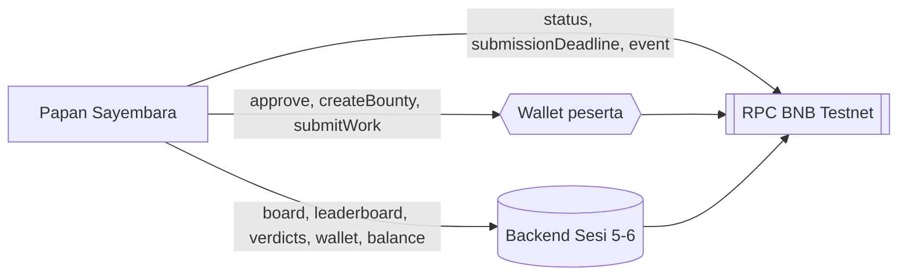

<h1 align="center">Frontend, Papan Sayembara (Sesi 7)</h1>

<p align="center">
  dApp UI untuk papan bounty: membaca dari backend Sesi 5-6, menulis langsung ke
  kontrak lewat wallet peserta sendiri.
</p>

<p align="center">
  
  
  
  
  
</p>

> [!NOTE]
> Kuncinya tidak pernah keluar dari wallet peserta. Beda dari Sesi 6 yang memakai
> relayer (backend memegang private key dan membelanjakan gasnya), di sini peserta
> menandatangani sendiri dan backend cuma jadi pembaca data.

## Daftar Isi

- [Cara jalan](#cara-jalan)
- [Peta berkas](#peta-berkas)
- [Dari mana datanya](#dari-mana-datanya)
- [Penyimpangan dari materi, beserta alasannya](#penyimpangan-dari-materi-beserta-alasannya)
- [Batas kepercayaan](#batas-kepercayaan)
- [Bukti jalan](#bukti-jalan)

## Cara jalan

Backend harus hidup lebih dulu, karena seluruh papan dibaca dari sana.

```bash
# terminal 1
cd backend && bun install && bun dev

# terminal 2
cd frontend && bun install && cp .env.example .env && bun dev
```

Buka `http://localhost:5173`.

| Variabel `.env`      | Wajib | Isinya                                                                                                                             |
| -------------------- | ----- | ---------------------------------------------------------------------------------------------------------------------------------- |
| `VITE_API_URL`       | tidak | Alamat backend, default `http://localhost:3000`                                                                                    |
| `VITE_WC_PROJECT_ID` | tidak | projectId WalletConnect (gratis di cloud.reown.com). Kosong berarti wallet lewat QR dimatikan, wallet ekstensi browser tetap jalan |
| `VITE_RPC_URL`       | tidak | RPC sendiri, dicoba lebih dulu sebelum daftar publik                                                                               |

Wallet butuh **tBNB** untuk gas ([faucet](https://www.bnbchain.org/en/testnet-faucet))
dan **RWD** untuk membuat bounty. RWD di sini adalah token deployment kita sendiri,
jadi faucet RWD milik panitia tidak berlaku; mintanya ke pemilik token.

## Peta berkas

| Berkas                              | Isinya                                                                          |
| ----------------------------------- | ------------------------------------------------------------------------------- |
| `src/lib/api.ts`                    | Pembungkus tipis endpoint backend, satu tempat untuk semua `fetch`              |
| `src/lib/contracts.ts`              | Alamat deployment, label status, dan ABI yang dipanggil                         |
| `src/lib/wagmi.ts`                  | Konfigurasi chain, daftar RPC, dan daftar wallet                                |
| `src/lib/actions.ts`                | Inti sesi ini: approve, `createBounty`, `submitWork`, penerjemah pesan error    |
| `src/lib/format.ts`                 | wei ke RWD, alamat pendek, waktu                                                |
| `src/components/bounty-card.tsx`    | Satu kartu bounty: status live, alasan juri AI, hitung mundur, form kirim bukti |
| `src/components/create-bounty.tsx`  | Form bikin bounty                                                               |
| `src/components/leaderboard.tsx`    | Peringkat worker                                                                |
| `src/components/punyaku.tsx`        | Bounty dan submission milik wallet yang tersambung                              |
| `src/components/connect-wallet.tsx` | Tombol RainbowKit plus saldo RWD                                                |
| `src/hooks/use-auto-refresh.ts`     | Dengar event chain, lalu suruh react-query ambil ulang                          |
| `src/hooks/use-hitung-mundur.ts`    | Hitung mundur deadline                                                          |
| `src/shims/wagmi-connectors.ts`     | Tambalan sementara, RainbowKit 2.2.11 belum mendukung wagmi v3                  |

## Dari mana datanya

Papan sengaja membaca dari dua sumber sekaligus, karena masing-masing punya yang tidak
dimiliki yang lain.



- **Alasan** putusan juri AI hanya ada di backend. Chain cuma menyimpan `true` atau
  `false`, jadi tanpa backend kartu bounty tidak bisa menjelaskan apa pun.
- **Status dan deadline** dibaca langsung dari chain, karena tabel indexer bisa
  tertinggal beberapa detik dari keadaan sebenarnya.

## Penyimpangan dari materi, beserta alasannya

Semua diukur pada 16 Agustus 2026, bukan ditebak.

| Yang diubah                                         | Alasan                                                                                                                                                                                                                                                                                                                         |
| --------------------------------------------------- | ------------------------------------------------------------------------------------------------------------------------------------------------------------------------------------------------------------------------------------------------------------------------------------------------------------------------------ |
| Alamat kontrak                                      | Deployment kita sendiri, bukan punya mentor                                                                                                                                                                                                                                                                                    |
| `VITE_WC_PROJECT_ID` jadi opsional                  | Materi mewajibkannya, dan tanpa itu halaman blank total. Di sini wallet WalletConnect baru didaftarkan kalau projectId ada, jadi tanpa projectId aplikasi tetap hidup dengan wallet ekstensi                                                                                                                                   |
| Daftar RPC diganti                                  | onfinality (pilihan pertama materi) membalas 429 tanpa kunci. drpc membalas 400 `method is not available on free plan` untuk `eth_newFilter`, padahal itu yang dipakai auto refresh. thirdweb lolos dari curl tapi **ditolak browser**: permintaan ber-Origin dibalas tanpa header CORS. Yang dipakai: publicnode dan bnbchain |
| `chainId` disebut eksplisit di tiap panggilan tulis | Tanpa itu wagmi menandatangani ke chain mana pun yang sedang aktif di wallet. Alamat yang sama bisa berisi kontrak lain di chain lain, dan hadiah melayang tanpa pesan salah apa pun                                                                                                                                           |
| Approve pas sejumlah hadiah sejak awal              | Ini bagian Tambahan 4 di materi, dipakai langsung karena `maxUint256` berarti factory boleh menarik seluruh saldo RWD selamanya. Konsekuensinya tiap bikin bounty perlu dua tanda tangan                                                                                                                                       |
| `waktu()` mengalikan 1000                           | Materi menulis `new Date(ms)`. Backend kita menyimpan `created_at` dalam DETIK (`Math.floor(Date.now() / 1000)` di `indexer/handlers.ts`), jadi versi materi menampilkan semua submission sebagai "21 Jan 1970"                                                                                                                |
| `tautanAman()` menyaring skema URL                  | `rulesURI` dan `proofURI` boleh diisi siapa pun lewat kontrak, lalu materi memasangnya langsung di `href`. React tidak menyaring skema, jadi `javascript:` di situ dieksekusi saat diklik, di halaman yang dompetnya sedang tersambung                                                                                         |
| Alamat escrow dicocokkan ke registri factory        | Sebelum `submitWork` ditandatangani, `bounties(bountyId)` dibaca dari factory dan dibandingkan dengan alamat yang datang dari backend. Backend yang tersusupi jadi tidak bisa mengarahkan tanda tangan pengguna ke kontrak lain                                                                                                |
| `chainId` juga di pembacaan dan watcher event       | Bukan cuma di tulis. Tanpa itu, saat wallet sedang di jaringan lain, hitung mundur menghilang dan papan berhenti menyegarkan diri tanpa pesan salah apa pun                                                                                                                                                                    |

> [!WARNING]
> Di basis data backend ada dua satuan waktu sekaligus: `bounties.created_at` dan
> `submissions.created_at` dalam detik, sedangkan `verdicts.created_at` dalam
> milidetik. Kolom terakhir belum ditampilkan di UI. Jangan campur keduanya.

## Batas kepercayaan

| Masukan                                        | Penjaga                                                                                                                                                                                                                                                  |
| ---------------------------------------------- | -------------------------------------------------------------------------------------------------------------------------------------------------------------------------------------------------------------------------------------------------------- |
| `rulesURI` dan `proofURI` dari pengguna        | Skemanya disaring `tautanAman()` sebelum masuk `href`, hanya http, https, dan ipfs yang lolos, karakter kendali dibuang lebih dulu. Yang mengambil ISI berkasnya adalah backend, dan di sanalah penjaga SSRF berada (`uriAman()` di `services/judge.ts`) |
| Tautan aturan dan bukti yang diklik dari kartu | `rel="noreferrer"` plus `target="_blank"`                                                                                                                                                                                                                |
| Alasan juri AI                                 | Ditampilkan sebagai teks React, bukan `dangerouslySetInnerHTML`, jadi HTML di dalamnya tidak pernah dieksekusi                                                                                                                                           |
| Chain yang aktif di wallet                     | `chainId` eksplisit di setiap tulis, baca, dan watcher; wagmi menolak sebelum tanda tangan                                                                                                                                                               |
| Jumlah izin ERC20                              | Pas sejumlah hadiah, bukan tak terbatas                                                                                                                                                                                                                  |
| Alamat escrow yang datang dari backend         | Dicocokkan dengan registri factory on-chain sebelum `submitWork` ditandatangani                                                                                                                                                                          |

## Bukti jalan

Diuji pada chain 97 tanggal 16 Agustus 2026, seluruhnya lewat UI dengan wallet yang
menandatangani sendiri.

| Langkah                                        | Bukti                                                                                                                                                                                                                                      |
| ---------------------------------------------- | ------------------------------------------------------------------------------------------------------------------------------------------------------------------------------------------------------------------------------------------ |
| Bikin bounty #8, hadiah 3 RWD, deadline 48 jam | tx [`0x4e8f7b8d...6143d`](https://testnet.bscscan.com/tx/0x4e8f7b8d88ce508e537867821d263c794b338481c4ae430e33bce3f51dc6143d), escrow [`0x602cA1EF...19c1`](https://testnet.bscscan.com/address/0x602cA1EF6EA7129596b477277BDE429201EF19c1) |
| Kirim bukti kerjaan                            | tx [`0xf6333f13...3ba70`](https://testnet.bscscan.com/tx/0xf6333f136d90df460c66dedbeb6e73ad432f28b780b9549d97e07aa4fc93ba70), kartu berubah jadi `Disubmit` tanpa muat ulang halaman                                                       |
| Juri AI memutus dan membayar                   | tx [`0x16643534...0252f`](https://testnet.bscscan.com/tx/0x16643534f4cbd4e98f2e9f52edf845f5a23c6defc3aa7f8b45da67807a40252f), kartu jadi `Selesai` dengan alasan lengkap, peringkat naik jadi 6 kali menang dan 123 RWD                    |
